# ☕ Java Contact Book with MySQL

A simple and elegant console-based contact management application built with **Core Java** and **MySQL**. This project demonstrates fundamental database operations (CRUD), object-oriented principles, and secure coding practices.

<br>

## ✨ Core Features

*   **👤 Add New Contact**: Save a new contact with their name, phone, email, and address.
*   **📖 View All Contacts**: Display a clean, formatted list of all saved contacts.
*   **🔍 Search Contacts**: Instantly find contacts by their name.
*   **✏️ Update Contact**: Easily modify the details of an existing contact using their ID.
*   **🗑️ Delete Contact**: Safely remove a contact from the database.
*   **🛡️ Secure**: Uses `PreparedStatement` to prevent common SQL injection attacks.

<br>

## 🚀 Technologies & Tools

| Technology | Purpose |
| :--- | :--- |
| **Java** | Core application logic |
| **MySQL** | Relational database for storing contacts |
| **JDBC** | Standard API for Java-to-Database communication |
| **Git & GitHub** | Version control and code sharing |

<br>

## ⚙️ How It Works: The Application Flow

The project is structured with a clear **separation of concerns**. Each class has one main job, making the code clean and easy to follow.

Here’s a simple data flow for adding a new contact:

```mermaid
graph TD;
    A[👨‍💻 User] -->|Enters contact details| B(⌨️ Main.java);
    B -->|Creates a Contact object| C(🗂️ ContactDAO.java);
    C -->|Asks for a DB connection| D(🔌 DBConnection.java);
    D -->|Connects to MySQL| E(🗄️ MySQL Database);
    C -->|Executes INSERT query| E;

    subgraph "User Interface"
        B
    end

    subgraph "Data Access Logic"
        C
        D
    end

    subgraph "Database"
        E
    end
     
```



*   `Main.java` handles what the user sees.
*   `ContactDAO.java` handles the "how" of database actions.
*   `DBConnection.java` manages the connection details.
*   `Contact.java` is the blueprint for a contact object.

<br>

## 🛠️ Setup Guide: Get It Running in 4 Steps

Follow these steps to get the project running on your local machine.

### Step 1: Clone the Project from GitHub

First, get a copy of the project on your computer. Open your terminal and run:

```bash
git clone https://github.com/YernintiRevathi/Contacts_book_NDV2_WEB 
```

<br>

### Step 2: Set Up the MySQL Database

You need a database and a table to store the contacts.

1.  Open your MySQL client (like MySQL Workbench or the command line).
2.  Run the script located in the `database_queries.sql` file. This will automatically create the `contact_book` database and the `contacts` table for you.

<br>

### Step 3: Configure Your Database Connection

Tell the Java application how to find your database.

1.  Open the `DBConnection.java` file.
2.  Find these two lines:
    ```java
    private static final String USER = "your_username";
    private static final String PASSWORD = "your_password";
    ```
3.  Replace `"your_username"` and `"your_password"` with your **actual MySQL username and password**.

<br>

### Step 4: Add the JDBC Driver & Run

The final step is to give Java the tool it needs to talk to MySQL.

1.  **Download the MySQL Connector/J**: This is a `.jar` file from the official MySQL website.
2.  **Add it to your project**:
    *   **In an IDE (Eclipse, IntelliJ):** Right-click your project, go to `Build Path` > `Configure Build Path` > `Libraries` > `Add External JARs...`, and select the downloaded file.
    *   Or add the jar file in lib folder as it is done here
3.  **Run the application**: Compile and run the `Main.java` file. The contact book menu will appear in your console!

---
with 💖 by **Revathi**
